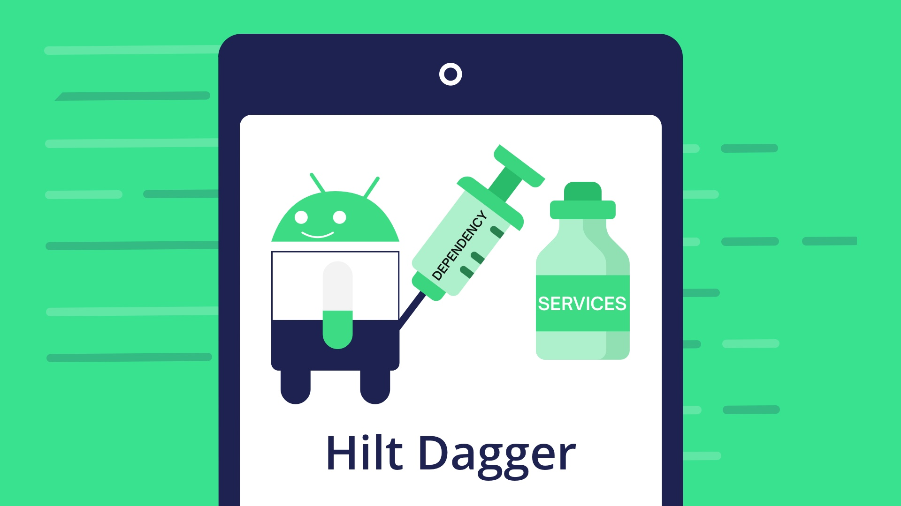
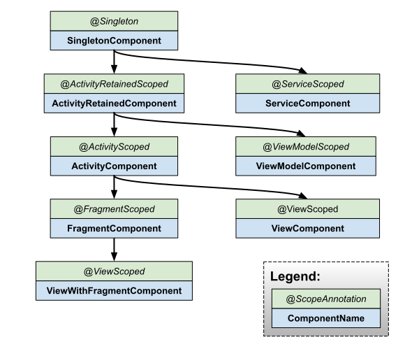

# Dependency Injection

Timofey Pletnev [@timatifey](https://t.me/timatifey)
---

## Dependency Injection

### What is a dependency?

```
Class A => *uses* => Class B
```

```
Client => *uses* => Service
```

### Class B is both a client and a service:

```
Class A => *uses* => Class B => *uses* => Class C
```

---

## How do clients get references to services?

- instantiation
- static method call (factory)
- static global variable
- gets references "outside"
- *reflection*

First three are active dependencies resolution, the fourth one is a dependency injection (DI).

DI is a providing services to clients from "outside".

---


## Dependency Injection

Usually DI has at least two meanings:

The act of providing (injecting) the required dependencies using one of the fundamental techniques: constructor, method or field injection (DI technique).

Dependency injection architecture pattern (DIAP).


---

## Dependency Injection techniques

```kotlin
class Client(private val service1: Service1) {

    private var service2: Service2? = null

    fun setService2(service2: Service2) {
        this.service2 = service2
    }

    lateinit var service3: Service3

    fun doSmth() {
        service1.doSmth1()
        service2.doSmth2()
        service3.doSmth3()
    }
}
```

---

## Dependency Injection techniques

### Constructor injection

Pros:
- simple
- constructor signature reflects deps
- injected fields can be [finalized](https://shipilev.net/blog/2014/safe-public-construction/) (val)
- easy to mock services in unit tests

Cons:
- none

---

## Dependency Injection techniques

### Method injection

Pros:
- method signature reflects deps
- can happen after construction

Cons:
- not as explicit as a constructor injection
- can lead to implicit ordering requirements (temporal coupling)

---

## Dependency Injection techniques

### Field injection (property in Kotlin)

Pros:
- can happen after construction

Cons:
- all cons of the method injection
- not evident deps

---

## Dependency Injection techniques

Constructor dependency injection technique looks best by far.

Prefer it to other techniques unless:
- no service instance at the moment of client instantiation (service locator)
- instantiation is out of your scope (e.g. Activity)
- limitations on constructor (e.g. Fragment)

---

## Dependency Injection

### What is it?

Most popular [answer](https://stackoverflow.com/questions/130794/what-is-dependency-injection) at the StackOverflow:

> Dependency Injection is passing dependency to other objects or framework

It's incomplete. It's just a technique.

---

## Dependency Injection architecture pattern

Segregates application logic into two sets of classes:

- **Functional set**

Contains classes that encapsulate core application functionality

- **Construction set**

Contains classes that resolve dependencies and instantiate objects from a functional set.

Each class in the app should be a part only of one of these sets.


```                                                                  
                Application                  
+----------------+        +-----------------+
|Construction set|        | Functional Set  |
|                |        |                 |
| Class1..       | <----> |  Class1..       |
|   ClassN       |        |    ClassN       |
+----------------+        +-----------------+
```

Segregation into these sets is a **Separation of concerns**.

Concerns of core app's functionality separated from concerns of creating and wiring.

---

## Dependency Injection architecture pattern

DI — separation of concerns at the highest level of abstraction.

It's not about frameworks, annotations, or any other implementation details.

---

## DI techniques vs DIAP

Different levels of abstraction (class vs application)

--

DI techniques - class level Single Responsibility Principle

--

DIAP - application level Separation of Concerns

--

DIAP implementations use DI techniques under the hood

--

It's not enough to employ DI techniques to build DIAP

---

## Dependency Injection sample

Myths:

- small applications don't need DI
- it doesn't worth investments
- DIAP is about frameworks

Pure Dependency Injection 
    aka Manual Dependency Injection
    aka Vanilla Dependency Injection
    aka Poor Man's Dependency Injection

Service Locator ≠ DIAP

[How is Dependency injection different from Service Locator? (RU)](https://medium.com/androidschool-ru/%D1%87%D0%B5%D0%BC-%D0%BE%D1%82%D0%BB%D0%B8%D1%87%D0%B0%D0%B5%D1%82%D1%81%D1%8F-dependency-injection-%D0%BE%D1%82-service-locator-5aacd7800cdd)

---

## Manual dependency injection

[Android Developer: Manual dependency injection](https://developer.android.com/training/dependency-injection/manual?hl=tr)


---

## Basics of manual dependency injection


---

```kotlin
class UserRepository(
    private val localDataSource: UserLocalDataSource,
    private val remoteDataSource: UserRemoteDataSource
) { ... }

class UserLocalDataSource { ... }
class UserRemoteDataSource(
    private val loginService: LoginRetrofitService
) { ... }
```
--
```kotlin
class LoginActivity: Activity() {

    private lateinit var loginViewModel: LoginViewModel

    override fun onCreate(savedInstanceState: Bundle?) {
        super.onCreate(savedInstanceState)

        val retrofit = Retrofit.Builder()
            .baseUrl("https://example.com")
            .build()
            .create(LoginService::class.java)
        val remoteDataSource = UserRemoteDataSource(retrofit)
        val localDataSource = UserLocalDataSource()
        val userRepository = UserRepository(localDataSource, remoteDataSource)

        loginViewModel = LoginViewModel(userRepository)
    }
}
```
---
## There are issues with this approach
--


1. There's a lot of boilerplate code. If you wanted to create another instance of LoginViewModel in another part of the code, you'd have code duplication.
--


2. Dependencies have to be declared in order. You have to instantiate UserRepository before LoginViewModel in order to create it.
--


3. It's difficult to reuse objects. If you wanted to reuse UserRepository across multiple features, you'd have to make it follow the singleton pattern. The singleton pattern makes testing more difficult because all tests share the same singleton instance.

---

## Managing dependencies with a container
--

```kotlin
// Container of objects shared across the whole app
class AppContainer {

    private val retrofit = Retrofit.Builder()
                            .baseUrl("https://example.com")
                            .build()
                            .create(LoginService::class.java)

    private val remoteDataSource = UserRemoteDataSource(retrofit)
    private val localDataSource = UserLocalDataSource()

    // userRepository is not private; it'll be exposed
    val userRepository = UserRepository(localDataSource, remoteDataSource)
}
```
--

```kotlin
// Custom Application class that needs to be specified
// in the AndroidManifest.xml file
class MyApplication : Application() {

    // Instance of AppContainer that will be used by all the Activities of the app
    val appContainer = AppContainer()
}
```
---

## Managing dependencies with a container

```kotlin
class LoginActivity: Activity() {

    private lateinit var loginViewModel: LoginViewModel

    override fun onCreate(savedInstanceState: Bundle?) {
        super.onCreate(savedInstanceState)

        // Gets userRepository from the instance of AppContainer in Application
        val appContainer = (application as MyApplication).appContainer
        loginViewModel = LoginViewModel(appContainer.userRepository)
    }
}
```
---


## Factory
--

```kotlin
interface Factory<T> { fun create(): T }

class LoginViewModelFactory(
    private val userRepository: UserRepository
) : Factory {
    override fun create(): LoginViewModel {
        return LoginViewModel(userRepository)
    }
}
```
--

```kotlin
class AppContainer {
    ...
    val userRepository = UserRepository(localDataSource, remoteDataSource)
    val loginViewModelFactory = LoginViewModelFactory(userRepository)
}

class LoginActivity: Activity() {

    private lateinit var loginViewModel: LoginViewModel

    override fun onCreate(savedInstanceState: Bundle?) {
        super.onCreate(savedInstanceState)
        val appContainer = (application as MyApplication).appContainer
        loginViewModel = appContainer.loginViewModelFactory.create()
    }
}
```
---

## There are issues with this approach
--

***but there are still some challenges to consider***
--

1. You have to manage AppContainer yourself, creating instances for all dependencies by hand.
--


2. There is still a lot of boilerplate code. You need to create factories or parameters by hand depending on whether you want to reuse an object or not.
---
## Managing dependencies in application flows
--

```kotlin
class LoginContainer(val userRepository: UserRepository) {

    val loginData = LoginUserData()

    val loginViewModelFactory = LoginViewModelFactory(userRepository)
}

// AppContainer contains LoginContainer now
class AppContainer {
    ...
    val userRepository = UserRepository(localDataSource, remoteDataSource)

    // LoginContainer will be null when the user is NOT in the login flow
    var loginContainer: LoginContainer? = null
}
```
---
## Managing dependencies in application flows

```koltin
class LoginActivity: Activity() {

    private lateinit var loginViewModel: LoginViewModel
    private lateinit var loginData: LoginUserData
    private lateinit var appContainer: AppContainer


    override fun onCreate(savedInstanceState: Bundle?) {
        super.onCreate(savedInstanceState)
        appContainer = (application as MyApplication).appContainer

        appContainer.loginContainer = LoginContainer(appContainer.userRepository)

        loginViewModel = appContainer
                    .loginContainer
                    .loginViewModelFactory
                    .create()
        loginData = appContainer.loginContainer.loginData
    }

    override fun onDestroy() {
        appContainer.loginContainer = null
        super.onDestroy()
    }
}
```
---

## Law of Demeter

Principle of the least knowledge

Minimize class dependencies

Use of [Law of Demeter](https://en.wikipedia.org/wiki/Law_of_Demeter) makes fewer dependencies and more readable and maintainable code.

--

## Pure dependency injection Injection cons

Pure DI is error-prone and forces you to write lots of code

Can be fixed with a DI framework

---

## Dependency Injection Framework

- External library
--


- Provides a specific template for Construction Set implementation
--


- Provides set of pre-defined conventions

---

## Dagger 2

Dagger 2 is the most mature DI framework for now
--

### History
--

- Dagger 1 by Square, deprecated (reflection based)
--

- Dagger 2 by Google
--

- dagger.android package, deprecated
--

- Dagger Hilt

### Cons

Dagger is considered the most complex DI framework in Android world

---

## Dependency Injection with Dagger 2

Uses Code generation
--

### Cons
--

- Poor docs

---


---

## Dependency Injection with Dagger 2

Uses Code generation


### Cons

- Poor docs
--


- Lack of best practices
--


- Too many features
--


### Pros
--

- No boilerplate code
--


- Easier to refactor
---

## How do I use it?
--

Then the lecture will go on for another 6 hours ...
--

- [Android Developer Dagger basics](https://developer.android.com/training/dependency-injection/dagger-basics)
--


- [Dagger 2 for Beginner Android Developers (RU)](https://habr.com/ru/post/343248/)


--

- [A series of video tutorials on the basics of Dagger 2 from Kirill Rozov (GDE) (RU)](https://www.youtube.com/playlist?list=PL0SwNXKJbuNkYFUda5rlA-odAVyWItRCP)


---

## Hilt

[Developer Android Hilt-android](https://developer.android.com/training/dependency-injection/hilt-android)


---

## Hilt documentaion?!
--

YES! [https://dagger.dev/hilt/](https://dagger.dev/hilt/)
--


### The goals of Hilt are

- To simplify Dagger-related infrastructure for Android apps.
--


- To create a standard set of components and scopes to ease setup, readability/understanding, and code sharing between apps.
--


- To provide an easy way to provision different bindings to various build types (e.g. testing, debug, or release).
---
class: center, middle
# Lets start
---

## Adding dependencies
--

Just copypaste...
---
## Adding dependencies

project *build.gradle*
```groovy
buildscript {
    ...
    dependencies {
        ...
        classpath 'com.google.dagger:hilt-android-gradle-plugin:2.38.1'
    }
}
```
--

*app/build.gradle*
```groovy
...
plugins {
  id 'kotlin-kapt'
  id 'dagger.hilt.android.plugin'
}

android {
    ...
}

dependencies {
    implementation "com.google.dagger:hilt-android:2.38.1"
    kapt "com.google.dagger:hilt-compiler:2.38.1"
}
```
---
## Hilt application class
--

## @HiltAndroidApp

```kotlin
@HiltAndroidApp
class ExampleApplication : Application() { ... }
```
---
## Inject dependencies into Android classes

## @AndroidEntryPoint

```kotlin
@AndroidEntryPoint
class ExampleActivity : AppCompatActivity() { ... }
```
--

Hilt currently supports the following Android classes

- Application (by using @HiltAndroidApp)
- ViewModel (by using @HiltViewModel)
- Activity
- Fragment
- View
- Service
- BroadcastReceiver

---
## Notes

If you annotate an Android class with @AndroidEntryPoint, then you also must annotate Android classes that depend on it. For example, if you annotate a fragment, then you must also annotate any activities where you use that fragment.
--

- Hilt only supports activities that extend ComponentActivity, such as AppCompatActivity.
--


- Hilt only supports fragments that extend androidx.Fragment.
--


- Hilt does not support retained fragments.

---
## @Inject

```kotlin
@AndroidEntryPoint
class ExampleActivity : AppCompatActivity() {

  @Inject lateinit var analytics: AnalyticsAdapter
  ...
}
```
--

```kotlin
class AnalyticsAdapter @Inject constructor(
  private val service: AnalyticsService
) { ... }
```
---

## Hilt



---

## Hilt

```sh
Android component          Default bindings
-----------------------------------------------------------------
SingletonComponent         Application
ActivityRetainedComponent  Application
ViewModelComponent         SavedStateHandle
ActivityComponent          Application, Activity
FragmentComponent          Application, Activity, Fragment
ViewComponent              Application, Activity, View
ViewWithFragmentComponent  Application, Activity, Fragment, View
ServiceComponent           Application, Service
```
---

## Inject interface instances with @Binds

```kotlin
interface AnalyticsService {
  fun analyticsMethods()
}

// Constructor-injected, because Hilt needs to know how to
// provide instances of AnalyticsServiceImpl, too.
class AnalyticsServiceImpl @Inject constructor(
  ...
) : AnalyticsService { ... }

@Module
@InstallIn(ActivityComponent::class)
abstract class AnalyticsModule {

  @Binds
  abstract fun bindAnalyticsService(
    analyticsServiceImpl: AnalyticsServiceImpl
  ): AnalyticsService
}
```
---

## Inject instances with @Provides

```kotlin
@Module
@InstallIn(ActivityComponent::class)
object AnalyticsModule {

  @Provides
  fun provideAnalyticsService(
    // Potential dependencies of this type
  ): AnalyticsService {
      return Retrofit.Builder()
               .baseUrl("https://example.com")
               .build()
               .create(AnalyticsService::class.java)
  }
}
```
---

## Component scopes

```sh
Android class    Generated component       Scope
-------------------------------------------------------------------
Application      SingletonComponent        @Singleton
Activity         ActivityRetainedComponent @ActivityRetainedScoped
ViewModel        ViewModelComponent        @ViewModelScoped
Activity         ActivityComponent         @ActivityScoped
Fragment         FragmentComponent         @FragmentScoped
View             ViewComponent             @ViewScoped
Service          ServiceComponent          @ServiceScoped
```
--
In the example, if you scope AnalyticsAdapter to the ActivityComponent using @ActivityScoped, Hilt provides the same instance of AnalyticsAdapter throughout the life of the corresponding activity

```kotlin
@ActivityScoped
class AnalyticsAdapter @Inject constructor(
  private val service: AnalyticsService
) { ... }
```
---
class: center, middle
# Some examples
---
## API Service
--

```kotlin
interface FinnhubAPI { ... }
```
--

```kotlin
@Module
@InstallIn(SingletonComponent::class)
object NetworkModule {

    @Singleton
    @Provides
    fun provideFinnhubService(): FinnhubAPI {
        ...
        return retrofit.create(FinnhubAPI::class.java)
    }
}
```
--

```kotlin
@Singleton
class FinnhubDataSource @Inject constructor(
    private val finnhubAPI: FinnhubAPI
) { ... }
```
---
## Room Module (SQLLite DataBase)
--

```kotlin
@Database( ... )
abstract class AppDatabase: RoomDatabase() {
    abstract fun stocksDao(): StocksDao
    abstract fun searchDao(): SearchDao
}
```
--

```kotlin
@Module
@InstallIn(SingletonComponent::class)
object RoomModule {

    @Singleton
    @Provides
    fun provideDatabase(@ApplicationContext context: Context): AppDatabase =
        Room
            .databaseBuilder(context, AppDatabase::class.java, "database")
            .build()

    @Singleton
    @Provides
    fun provideStocksDao(appDatabase: AppDatabase): StocksDao = 
        appDatabase.stocksDao()

    @Singleton
    @Provides
    fun providesSearchDao(appDatabase: AppDatabase): SearchDao = 
        appDatabase.searchDao()
}
```
---
## Summary

```kotlin
@Singleton
class StocksRepository @Inject constructor(
    private val stocksDao: StocksDao,
    private val finnhubDataSource: FinnhubDataSource,
) { ... }
```
--

```koltin
@HiltViewModel
class StocksViewModel @Inject constructor(
    private val stocksRepository: StocksRepository,
    private val searchRepository: SearchRepository,
    application: Application
) : ViewModel() { ... }
```
--

```kotlin
@AndroidEntryPoint
class StocksFragment : Fragment() {
    private val stockViewModel: StocksViewModel by viewModels()
    ...
}
```
--

```kotlin
@AndroidEntryPoint
class MainActivity : AppCompatActivity() { ... }
```
--

```kotlin
@HiltAndroidApp
class App: Application()
```
---

## Conclusion
--

Dependency injection provides your app with the following advantages
--

- Reusability of classes and decoupling of dependencies: It's easier to swap out implementations of a dependency. Code reuse is improved because of inversion of control, and classes no longer control how their dependencies are created, but instead work with any configuration.
--


- Ease of refactoring: The dependencies become a verifiable part of the API surface, so they can be checked at object-creation time or at compile time rather than being hidden as implementation details.
--


- Ease of testing: A class doesn't manage its dependencies, so when you're testing it, you can pass in different implementations to test all of your different cases.
---